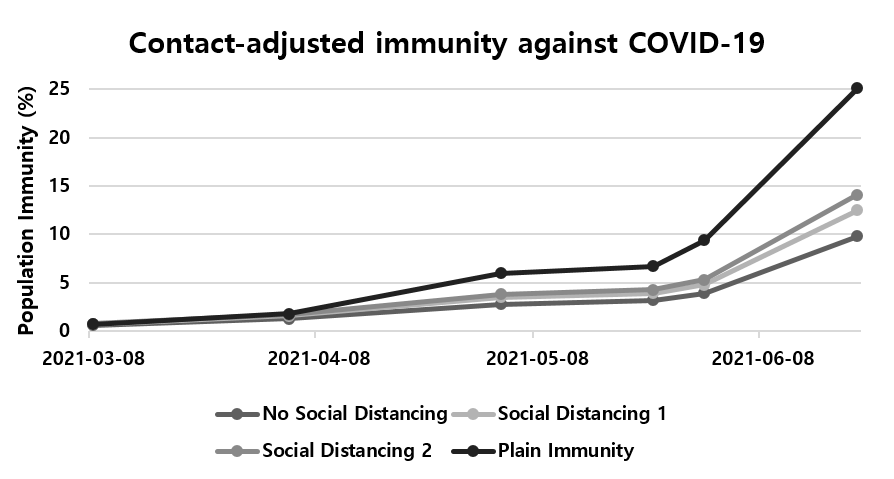

# Contact-adjusted immunity levels against COVID-19 in South Korea

June Young Chun1, Hwichang Jeong2 Yongdai Kim2

1 Department of Internal Medicine, National Cancer Center, Goyang, South Korea

2 Department of Statistics, Seoul National University, Seoul, South Korea

## Main Concept: 
Following the general concept of previous study:
June Young Chun, Wan Beom Park, Nam Joong Kim, Eun Hwa Choi, Sebastian Funk, Myoung-don Oh (2019). Estimating contact-adjusted immunity levels against measles in South Korea and prospects for maintaining elimination status.

Detailed Method:
Contact-adjusted immunity *r'* is given by

*r'=1−R/R0*

where *R/R0* is the ratio of the effective reproduction number *R* to the basic reproduction number *R0*.
In an age-structured population, the basic reproduction number is related to the contact matrix via

*R0=&rho;(K)*

where *&rho;* denotes the spectral radius and *K* is a matrix with elements

*kij=ϕijNi/Nj*

where *ϕij* is the number of contacts that an individual in age group *i* makes with that in age group *j*, and *Ni* is the size of age group *i*. The effective reproduction number *R* is obtained in the same way, except that the matrix *K* is multiplied with a vector of susceptibility to yield an effective matrix *K'*

*k'ij=kij(1−ri)*

where *ri* is the proportion immune in age group *i*.

Here, we included both vaccinated and infected individuals in age group *i* as immune (*ri* ). We could only include population who received one dose of COVID-19 vaccine, and assume 86% of vaccine efficacy for Astrazeneca vaccine and 89.7% efficacy for Pfizer vaccine according to the KDCA report. For those who have been infected by COVID-19, we regard they acquired 100% of immunity. 

We tried to capture the changes of contact patterns as a result of social distancing measures, and much detailed method could be found in the manuscript “COVID-19 Vaccine Prioritisation in Japan and South Korea” (doi: https://doi.org/10.1101/2021.04.16.21255649). 

## Conclusion:
The contact adjusted immunity against COVID-19 by May 24th, 2021 under the social distancing level 2 is __**4.36%**__ (3.91% under the social distancing level 1). 

※ The optimal distribution of COVID-19 vaccines under the limited resources could be found in the study below. 
COVID-19 Vaccine Prioritisation in Japan and South Korea
doi: https://doi.org/10.1101/2021.04.16.21255649

{: width="100" height="100"}
